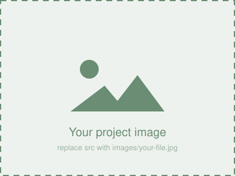

# sheinlee.github.io

Shicheng Li 的个人网站源码。用 GitHub Pages 托管，网址：<https://sheinlee.github.io>

## 文件结构

```
index.html                        网站主页（内容 + 样式 + 脚本都在这一个文件里）
images/                           图片文件夹，自己的图片都放这里
  favicon.svg                     浏览器标签页的小图标，也用作页头图标
  profile-placeholder.svg         About Me 头像占位图
  placeholder.svg                 Research 配图占位图
  gallery-placeholder.svg         Photo Gallery 占位图
.nojekyll                         让 GitHub Pages 直接发布静态文件，跳过 Jekyll 处理
```

整站没有任何外部依赖（图标是内嵌 SVG，没用 CDN），断网、国内访问都能正常显示。

## 如何发布（首次设置）

1. 打开仓库的 **Settings → Pages**
2. **Source** 选 `Deploy from a branch`
3. **Branch** 选 `main`，文件夹选 `/ (root)`，点 **Save**
4. 等 1–2 分钟，网站就会出现在 <https://sheinlee.github.io>

之后每次往 `main` 推送改动，网站会自动重新发布（一般 1 分钟内生效，看不到变化就强制刷新浏览器：Cmd/Ctrl + Shift + R）。

## 页面结构

| 版块 | id | 内容 |
| --- | --- | --- |
| 页头 | — | 姓名、一句话简介、邮箱、GitHub 图标 |
| About Me | `#about` | 圆形头像 + 自我介绍 |
| Research | `#research` | 4 个研究方向：配图 + 标题 + 描述 + 论文链接 |
| Publications | `#publications` | 已发表论文、in preparation、会议报告 |
| Experience | `#experience` | 教育经历、科研经历、教学/服务、荣誉奖项 |
| Skills | `#skills` | 技术栈 |
| Hobbies | `#hobbies` | 爱好（**待填**） |
| Photo Gallery | `#gallery` | 照片墙，点击弹出大图（**待填**） |

**用不到的版块**：把 `<nav>` 里对应的 `<a href="#xxx">` 和下面对应的整个 `<section id="xxx">…</section>` 一起删掉即可。

## 还需要你补的内容

在 `index.html` 里搜 `TODO` 就能挨个找到：

- [ ] **个人照片** —— 放进 `images/`，把 About Me 里的 `profile-placeholder.svg` 换掉
- [ ] **Research 配图** —— 4 张，论文里的图就很合适
- [ ] **Hobbies** —— 简历里没有，现在是 Hobby one/two/three 占位
- [ ] **Photo Gallery 照片** —— 会议、组会、旅行照片都行
- [ ] **LinkedIn 链接** —— 页头里已经写好了，取消注释并填上链接即可
- [ ] **Google Scholar 链接** —— 同上，建好主页后取消注释
- [ ] **求职那段话** —— About Me 最后一段，按实际情况改或删

## 如何修改内容

### 换图片

把图片放进 `images/` 文件夹，然后改 `src`：

```html

<!-- 改成 -->

```

注意文件名大小写要完全一致 —— GitHub Pages 区分大小写，本地能显示不代表线上能显示。

### 加一张照片到 Photo Gallery

复制粘贴一个 `.gallery-item`，改 `src`、`alt` 和 `overlay` 里的说明文字即可，JavaScript 不用动：

```html
<button class="gallery-item" type="button">
  
  <div class="overlay">照片说明</div>
</button>
```

### 加一个研究方向

复制粘贴一个 `.project` 块。想放视频而不是图片，把 `` 换成：

```html
<video autoplay loop muted playsinline>
  <source src="images/your-video.mp4" type="video/mp4">
</video>
```

### 换配色

`index.html` 里 `<style>` 开头的 `:root` 块统一控制全站配色，只改那几行就能换主题：

```css
--accent:       #6a8d73;  /* 主题色：页头背景、标题、导航 */
--accent-hover: #cfa5b0;  /* 鼠标悬停颜色 */
--page-bg:      #f9f7f5;  /* 页面背景 */
```

想用回原模板的亮绿色，把 `--accent` 改成 `#2ecc71` 即可。

## 本地预览

在仓库目录下运行：

```bash
python3 -m http.server 8000
```

然后浏览器打开 <http://localhost:8000>。（直接双击 `index.html` 也能看，但用本地服务器更接近线上效果。）
